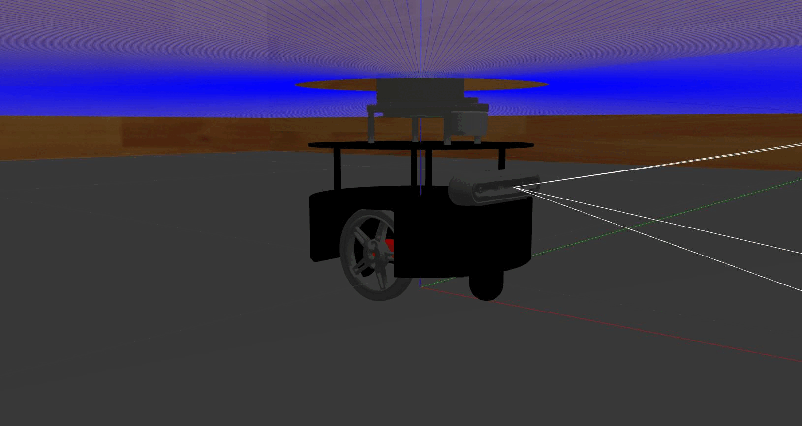
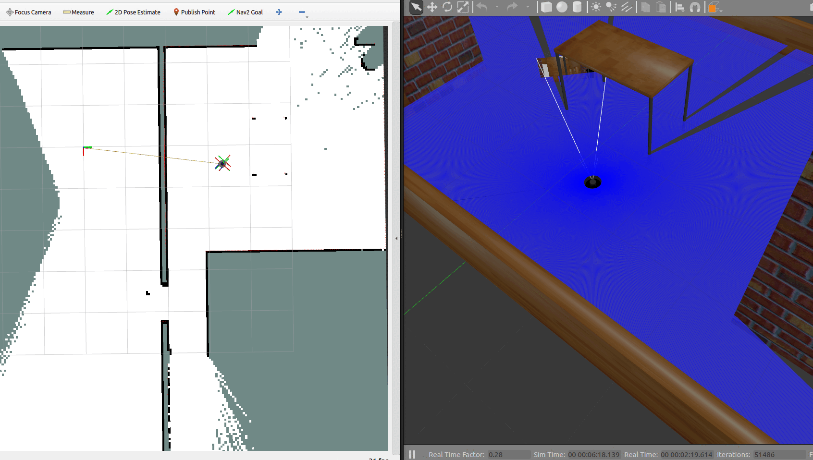
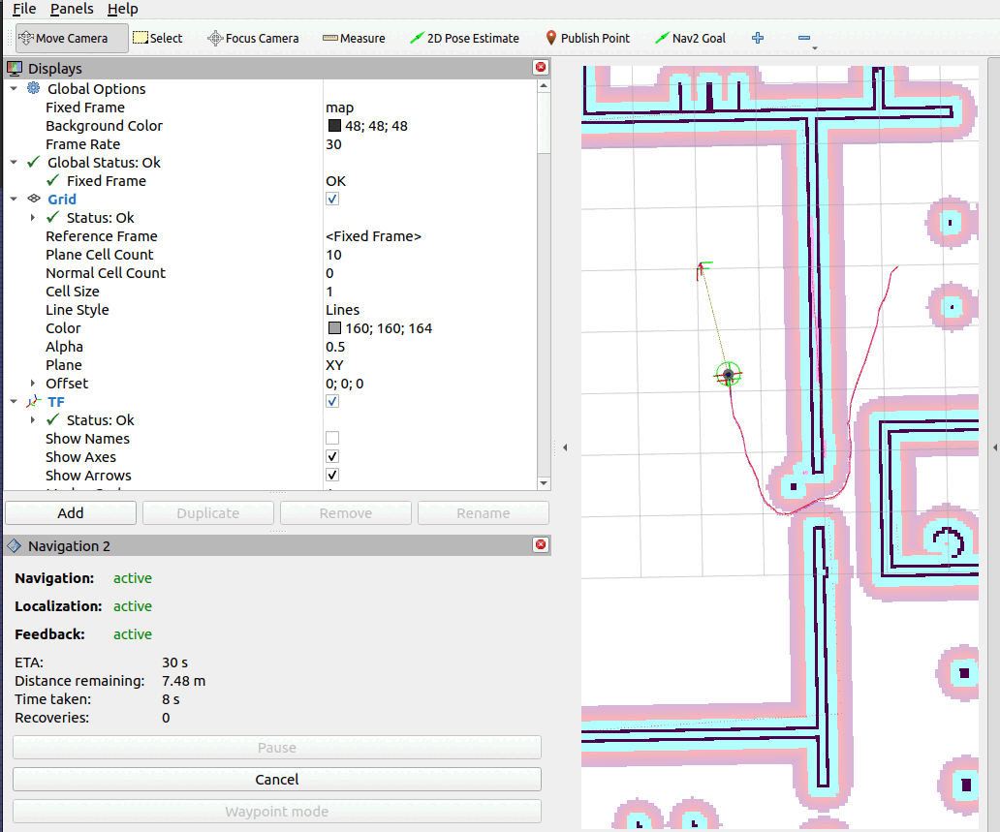

# HomeBot-ROS2-Navigation
HomeBot-ROS2-Navigation: A ROS2-powered robotic platform for autonomous indoor navigation and mapping.

 

## Project Overview
This repository contains a suite of ROS2 packages for the HomeBot, an autonomous robot designed for indoor navigation and mapping. The provided image showcases the HomeBot's physical design, which the following packages bring to life:

- `robot_description`: Defines the robot's physical parameters, including its URDF files, visual meshes, and essential configurations for simulation purposes.
- `robot_simulation`: Contains the necessary configurations and launch files for simulating the HomeBot in a household environment, using tools like Gazebo and RViz for SLAM and navigation testing.
- `robot_patrol`: Implements a patrolling behavior, directing the robot to navigate autonomously through a series of predefined waypoints based on the generated map data.

These packages represent the core components of the HomeBot's functionality, demonstrating practical applications of ROS2 in robotic indoor navigation.

## Getting Started
### Prerequisites
  **ROS2 (tested with ROS2 Humble)** - [Documentation](https://docs.ros.org/en/humble/index.html)
  
  **Python 3.10**

  **Nav2** - [Github](https://github.com/ros-planning/navigation2) and [Documentation](https://navigation.ros.org/)
  
  **Slam_toolbox** - [Github](https://github.com/SteveMacenski/slam_toolbox)
    
## Installation

1. **Create a ROS 2 workspace (if one does not already exist):**
   
   ```sh
   mkdir ~/your_workspace-name_ws
   cd ~/your_workspace-name_ws
   
2. **Clone this repository into your workspace:**
   
   ```sh
   git clone https://github.com/aimechengineer/HomeBot-ROS2-Navigation.git src

3. **Build the workspace:**
   ```sh
   cd ~/your_workspace-name_ws
   colcon build --symlink-install

4. **Source the setup script:**
   ```sh
   source ~/your_workspace-name_ws/install/setup.bash
   
## Additional Steps for Gazebo Simulation
If Gazebo does not launch the simulation correctly, use the following commands to set up the robot_description package in the Gazebo models directory, keeping only the meshes directory:

1. **Copy the entire robot_description package to the Gazebo models directory**
   
   ```sh
   cp -r path_to_robot_description_package ~/.gazebo/models/robot_description   
Replace **path_to_robot_description_package** with the actual path to your **robot_description** package.

2. **Remove all contents from the copied robot_description package except for the meshes directory**

   Navigate to the robot_description directory in the Gazebo models directory:

       cd ~/.gazebo/models/robot_description

   Then, remove all directories except for meshes:

       rm -rf !(meshes)
   This process will ensure that only the meshes directory is retained in the robot_description package within the Gazebo models directory, which should help resolve any simulation launch issues.

## Usage
### robot_description
**Display HomeBot in RViz:**

    ros2 launch robot_description display.launch.xml

**Display HomeBot in Gazebo and Rviz:**

    ros2 launch robot_description gazebo.launch.xml

### robot_simulation and robot_patrol
#### SLAM Process
Perform SLAM and generate a map of the environment:

1. **Launch the SLAM simulation:**
   Start the SLAM Process:

       ros2 launch robot_simulation house_slam.launch.py
       
3. **Control HomeBot:**
   Use teleop to manually control HomeBot during SLAM:
   
       ros2 run teleop_twist_keyboard teleop_twist_keyboard
   
  

#### Autonomous Navigation
Navigate autonomously in the environment post-SLAM:
1. **Launch Gazebo and RViz with Nav2 Configuration**:
   To initialize the simulation environment in Gazebo along with RViz configured for Nav2, use the following launch command:

       ros2 launch robot_simulation house_sim.launch.py
   
3. **Start Navigation:**
   Launch the navigation stack:

       ros2 launch robot_simulation autonomous_navigation.launch.py

   Once the 2D Pose Estimate is set in RViz, HomeBot can autonomously navigate the environment. Alternatively, you can start the patrol mode:

       ros2 run robot_patrol robot_patrol 
   In patrol mode, HomeBot will navigate to predefined locations autonomously.

 

## License

This project is licensed under the MIT License - see the   file for details.
